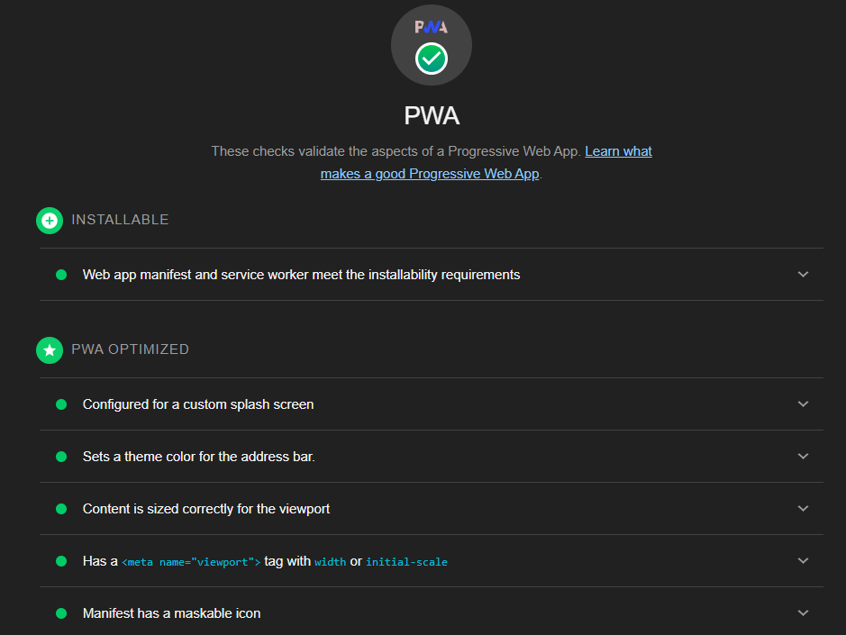

## Overview

Goober is a PWA (Progressive Web Application) ride-share taxi service designed to connect riders with available drivers, providing a seamless experience for all users.

## Table of Contents

- [Technical Overview](#technical-overview)
- [Product Decisions and Tradeoffs](#product-decisions-and-tradeoffs)
- [UX Decisions](#ux-decisions)
- [Risk and Unknowns](#risk-and-unknowns)
- [ERD Schema, PWA and Lint](#erd-pwa-lint)
- [Developer Roadmap](#developer-roadmap)
- [Installation and Guide](#installation-and-guide)

## Technical Overview

### Frontend

- **Framework:** [Next.js](https://nextjs.org/)
- **UI Library:** [Chakra UI](https://chakra-ui.com/)
- **State Management:** [React Context API](https://react.dev/reference/react/useContext)
- **CSS Framework:** [Tailwind CSS](https://tailwindcss.com/)
- **JavaScript Engine:** [T3](https://create.t3.gg/)
- **Type-checking:** [TypeScript](https://www.typescriptlang.org/)

### Backend

- **Server Framework:** [tRPC](https://trpc.io/)
- **Database:** [PostgreSQL](https://www.postgresql.org/)
- **ORM:** [Prisma](https://www.prisma.io/)
- **Real-time Features:** [Supabase](https://supabase.com/)

### Infrastructure

- **Deploy:** [Vercel](https://vercel.com/)
- **Production Logging:** [Axiom](https://axiom.co/)

## Product Decisions and Tradeoffs

Oh, what a ride. I am always grateful for the chance to learn new technologies, such as Supabase and T3, while simultaneously striving for this great opportunity.
While I had previous experience with Firebase, it offered a solid foundation but also presented its own set of challenges on the way.

Since we didn't need to waste time implementing any acomplex authentication/user profiles, instead I've created a simple register/login page with a switch for choosing one of the 2 available personas (riders and drivers). This way, being able to create a corresponding model table for each and making the necessary relationships with the rest of the schema. Also, instead of using a real and complex auth system to validate, I decided instead to create my own simple validation custom hook with React Context, after login it validates the user email/encrypted password on the database, saves it to the context and local browser storage.  
Ultimately, this decision was made by thinking about flexibillity and scallability of the project.

The find driver algorithm was really fun to build, it took me back to the times where I worked at a startup and we used to brainstorm lots of ideas. The algorithm works in a way to ensure fair competition between drivers. It searches for the last location of the available drivers that are not in a ride, then filters and looks for the closest ones to the pickup location coords. If the are more than one in certain radius, it randomly chooses one.

I also decided to focus more on the front-end and design. The feature I found to be the most impressive was the responsiveness of the UX/UI layout in the WepApp. I consistently strive to prioritize accessibility in my development process.

I spent about a week on the whole project. Having to attend work, taking care of some development and deploys at the same time, made it a little bit harder this challenge.
There is still room for improvement, but overall I am really glad of what was made within this time.

- **Ride Request Process:**

  - Riders can request a taxi ride, specifying pickup and dropoff locations.
  - Goober automatically dispatches available drivers, providing a quote based on trip distance and other factors.
  - Riders do not need to select a driver; the system handles the assignment.
  - Riders can cancel ongoing rides.

- **Driver Interaction:**

  - Drivers can receive ride requests and choose to accept or decline.
  - Each ride comes with an indication of the payment amount.
  - Once a ride is accepted, drivers won't receive new requests until the ride is complete.
  - Drivers receive relevant information for pickup and completion of the ride.
  - Drivers can cancel ongoing rides.

- **User Flow:**

  - Streamlined user flows for both riders and drivers.
  - Intuitive interfaces for requesting rides and managing ongoing rides.
  - Clear communication of ride details, including pickup and dropoff locations.
  - Minimal user interactions to ensure a smooth experience.

## Risk and Unknowns

- **Risk:** Handling real-time updates and notifications efficiently.

  - **Resolution Plan:** Implement and test Supabase integration thoroughly. Explore strategies for optimizing real-time communication.

- **Unknown:** Scalability challenges as the user base grows.
  - **Resolution Plan:** Regularly assess application performance and scalability. Implement optimizations based on usage patterns.

## ERD Schema, PWA and Lint





## Developer Roadmap

- [x] **Project Initial Setup**

  - [x] Initialize Next.js project
  - [x] Configure Prisma with PostgreSQL
  - [x] Configure Supabase integration
  - [x] Create a simple user auth for logged in users
  - [x] Set up Tailwind CSS
  - [x] Set up Chakra UI

- [x] **Frontend Styling and UX**

  - [x] PWA implementation: write a serviceWorker, test with Lighthouse, etc
  - [x] Cleanup default layout
  - [x] Create initial pages
  - [x] Create initial components
  - [x] Implement user interactions and navigation
  - [x] Style frontend components
  - [x] Optimize for responsive design
  - [x] Refactoring

- [x] **Backend Integration**

  - [x] Define Prisma data model
  - [x] Implement backend logic using tRPC
  - [x] Add Image to Storage

- [x] **Documentation and Deployment**

  - [x] Deploy the application to Vercel
  - [x] Configure production log system with Axiom
  - [x] Create a detailed README.md

- **Future Implementations**
  - Add Cron to expired/completed rides
  - Subs to Ride / Notification DB
  - Set up OneSignal for notification

## Installation and Guid

> In order to run locally download the .env file from the gist, or copy all its content and place in a .env file in the root of the project.

[Here is the .env file to run the app locally](https://gist.github.com/le0piovesan/52ae22edbd8b0b75f2d1fdb894bf460e) 🔐

Then run the following commands:

```bash
# Install dependencies
npm install

# Build the app
npm run build

# Start the app
npm start
```

<hr/>

[Here is the link of the deployable app](https://goober-three.vercel.app/) 🚀

[Here is a quick video showing the features](https://youtu.be/tfvZpwec8tE) 👀
