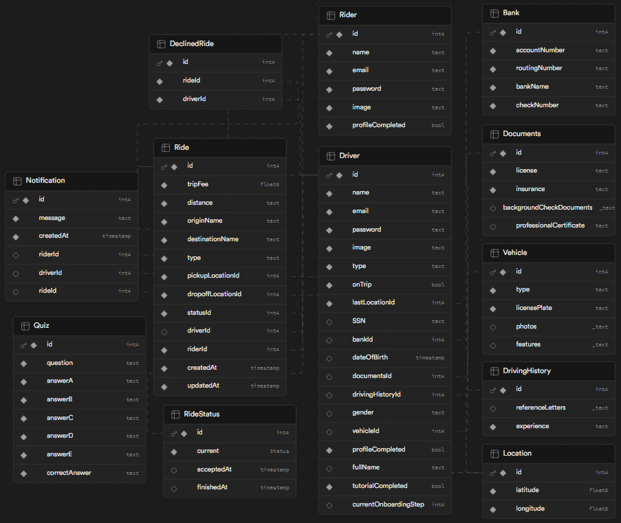

## Overview

Goober is a PWA (Progressive Web Application) ride-share taxi service designed to connect riders with available drivers, providing a seamless experience for all users.

## Table of Contents

- [Technical Overview](#technical-overview)
- [Product Decisions](#product-decisions)
- [UX Decisions](#ux-decisions)
- [Risk and Unknowns](#risk-and-unknowns)
- [ERD Schema, PWA and Lint](#erd-pwa-lint)
- [Developer Roadmap](#developer-roadmap)
- [Sneak Peek](#sneak-peek)
- [Final Considerations](#final-considerations)

## Technical Overview

### Frontend

- **Framework:** [Next.js](https://nextjs.org/)
- **UI Library:** [Chakra UI](https://chakra-ui.com/)
- **State Management:** [React Context API](https://react.dev/reference/react/useContext)
- **CSS Framework:** [Tailwind CSS](https://tailwindcss.com/)
- **JavaScript Engine:** [T3](https://create.t3.gg/)
- **Type-checking:** [TypeScript](https://www.typescriptlang.org/)

### Backend

- **Server Framework:** [tRPC](https://trpc.io/)
- **Database:** [PostgreSQL](https://www.postgresql.org/)
- **ORM:** [Prisma](https://www.prisma.io/)
- **Real-time Features:** [Supabase](https://supabase.com/)

### Infrastructure

- **Deploy:** [Vercel](https://vercel.com/)
- **Logging:** [Axiom](https://axiom.co/)

## Product Decisions

- **Ride Request Process:**

  - Riders can request a taxi ride, specifying pickup and dropoff locations.
  - Goober automatically dispatches available drivers, providing a quote based on trip distance and other factors.
  - Riders do not need to select a driver; the system handles the assignment.
  - Riders can cancel ongoing rides.

- **Driver Interaction:**
  - Drivers can receive ride requests and choose to accept or decline.
  - Each ride comes with an indication of the payment amount.
  - Once a ride is accepted, drivers won't receive new requests until the ride is complete.
  - Drivers receive relevant information for pickup and completion of the ride.
  - Drivers can cancel ongoing rides.

## UX Decisions

- **User Flow:**

  - Streamlined user flows for both riders and drivers.
  - Intuitive interfaces for requesting rides and managing ongoing rides.
  - Clear communication of ride details, including pickup and dropoff locations.
  - Minimal user interactions to ensure a smooth experience.

- **Real-time Updates:**
  - Leverage Supabase for real-time updates on ride requests and status changes.
  - Provide notifications to both riders and drivers for important events (e.g., ride acceptance, cancellation).

## Risk and Unknowns

- **Risk:** Handling real-time updates and notifications efficiently.

  - **Resolution Plan:** Implement and test Supabase integration thoroughly. Explore strategies for optimizing real-time communication.

- **Unknown:** Scalability challenges as the user base grows.
  - **Resolution Plan:** Regularly assess application performance and scalability. Implement optimizations based on usage patterns.

## ERD Schema, PWA and Lint

## Developer Roadmap

- [x] **Project Initial Setup**

  - [x] Initialize Next.js project
  - [x] Configure Prisma with PostgreSQL
  - [x] Configure Supabase integration
  - [x] Create a simple user auth for logged in users
  - [x] Set up Tailwind CSS
  - [x] Set up Chakra UI

- [x] **Frontend Styling and UX**

  - [x] PWA implementation: write a serviceWorker, test with Lighthouse, etc
  - [x] Cleanup default layout
  - [x] Create initial pages
  - [x] Create initial components
  - [x] Implement user interactions and navigation
  - [x] Style frontend components
  - [x] Optimize for responsive design
  - [x] Refactoring

- [x] **Backend Integration**

  - [x] Define Prisma data model
  - [x] Implement backend logic using tRPC
  - [x] Add Image to Storage

- [x] **Documentation and Deployment**

  - [x] Deploy the application to Vercel
  - [x] Configure production log system with Axiom
  - [x] Create a detailed README.md

- **Future Features**
  - Add Cron to expired/completed rides
  - Subs to Ride / Notification DB
  - Set up OneSignal for notification

## Sneak Peek:

[Here is a quick video showing the features](https://youtu.be/tfvZpwec8tE) 👀

[Here is the link of the deployable app](https://goober-three.vercel.app/) 🚀

## Final Considerations

Oh, what a ride. I am always grateful for having the chance to learn new technologies, such as Supabase and T3, while simultaneously striving for this great opportunity.
While I had previous experience with Firebase, it offered a solid foundation but also presented its own set of challenges on the way. Having to attend work, taking care of some development and deploys at the same time, made it a little bit harder this challenge.
There are still room for improvement, but overall I am really glad of what I could made within a week!

The feature I found to be the most impressive was the responsiveness of the UX/UI layout in the WepApp. I consistently strive to prioritize accessibility in my development process.
